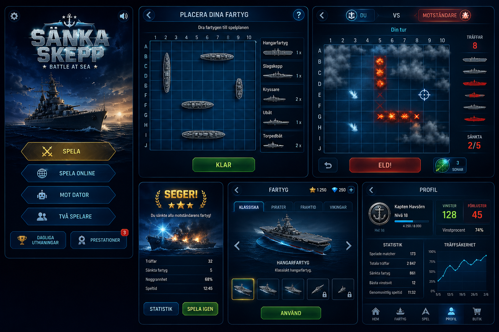

# Sänka Skepp – Battle at Sea

Ett modernt, responsivt Sänka Skepp-spel för webb och mobil, byggt med React,
TypeScript, Vite och Tailwind CSS. Installeras som PWA och fungerar offline.



## Funktioner

- **Spela mot datorn** med tre svårighetsgrader:
  - *Lätt* – slumpmässiga skott
  - *Medel* – jagar vidare runt träffar och följer linjer
  - *Svår* – sannolikhetskarta över alla möjliga fartygsplaceringar, minns
    tidigare träffar och söker effektivt
- **Två spelare på samma enhet** med överlämningsskärm mellan turerna
- **Placering** med drag & drop (mus och touch via Pointer Events), tryck för
  att rotera, slumpa och töm
- **Effekter**: explosion, kvarvarande eld, vattenstänk med ringar, stor
  explosion + rök + sjunkande fartyg vid sänkning, skakande bräde
- **Ljud**: alla effekter och ambient musik syntetiseras med Web Audio API
  (inga ljudfiler)
- **Statistik** i LocalStorage: matcher, vinster, förluster, vinst-/träffprocent,
  kortaste/längsta match, sänkta fartyg, bästa vinstsvit
- **8 prestationer** med upplåsningsdatum
- **Inställningar**: musik, ljudeffekter, animationer, mörkt/ljust tema,
  svenska/engelska
- **PWA**: manifest + service worker via vite-plugin-pwa

## Kom igång

```bash
npm install
npm run dev      # dev-server
npm test         # vitest – spellogik och AI
npm run build    # typkontroll + produktionsbygge till dist/
```

## Struktur

```
src/
  game/        Ren spellogik utan React (bräde, motor, AI) + tester
  state/       Zustand-stores: match, inställningar, statistik, prestationer
  i18n/        Översättningar sv/en + useTranslation-hook
  audio/       WebAudio-ljudmotor (syntetiserade effekter + musik)
  components/
    board/     Bräde, fartygssprites och effektlager
    screens/   Meny, placering, spel, överlämning, resultat, inställningar,
               statistik, prestationer
    ui/        Knappar, ikoner, reglage
tools/         process-images.mjs – efterbehandlar AI-genererade bilder
public/assets/generated/   Optimerade webp-bilder (fartyg, ikoner, bakgrunder)
```

## Bilder

Alla bilder är AI-genererade (OpenAI via bildgen-MCP) utifrån `Mockup.png` och
efterbehandlas med sharp (`node tools/process-images.mjs`): fartygen trimmas
och roteras till liggande, ikoner skalas ned och allt konverteras till webp.
Råbilderna ligger i `assets/generated/` (ej i git); de optimerade i
`public/assets/generated/`. Knappar, paneler, rutnät och markörer ritas i
CSS för skärpa och responsivitet.

## Designspec

Se [docs/superpowers/specs/2026-07-17-sanka-skepp-design.md](docs/superpowers/specs/2026-07-17-sanka-skepp-design.md).
